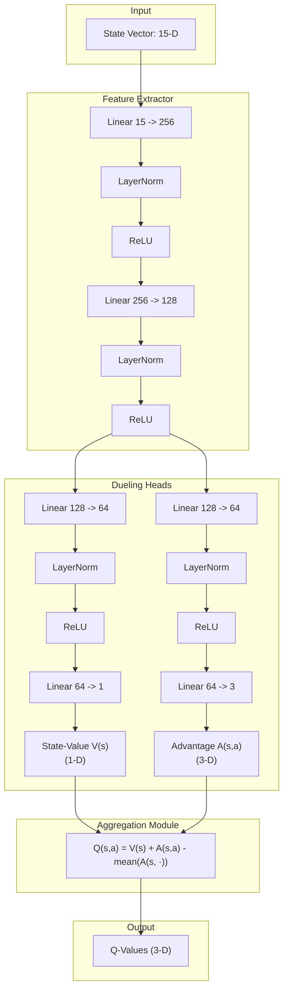

# Báo cáo Học thuật: Tối ưu hóa Mô hình Học tăng cường sâu Dueling Double DQN với Prioritized Experience Replay trong Chrome Dinosaur Agent

## Tóm tắt (Abstract)
Báo cáo này nghiên cứu phương pháp áp dụng Học tăng cường sâu (Deep Reinforcement Learning - DRL) để giải quyết bài toán điều khiển khủng long tự động trong môi trường Chrome Dinosaur. Chúng tôi thiết lập môi trường dưới dạng một Quá trình Quyết định Markov (Markov Decision Process - MDP) với không gian trạng thái đặc trưng 15 chiều ($15\text{-D}$ State Vector) được chuẩn hóa vật lý và không gian hành động rời rạc 3 chiều. Để tối ưu hóa quá trình học và giải quyết các thách thức như ước lượng giá trị quá cao ($Q$-value overestimation), phân phối phần thưởng thưa thớt (sparse reward distribution), và phi tĩnh của mẫu dữ liệu huấn luyện, chúng tôi đề xuất và triển khai kiến trúc **Dueling Double Deep Q-Network (Dueling DDQN)** kết hợp bộ nhớ đệm ưu tiên theo sai số Temporal Difference (**Prioritized Experience Replay - PER**). Ngoài ra, các kỹ thuật bổ trợ bao gồm làm mịn quỹ đạo nhảy dựa trên mô phỏng vật lý parabol, chuẩn hóa lớp (Layer Normalization), và bao phủ không gian trạng thái tốc độ cao (**Speed-Range Coverage**) đã giúp mô hình hội tụ ổn định và đạt điểm số vượt trội ở các dải tốc độ cực đại ($20.0\text{ px/frame}$).

---

## 1. Đặt vấn đề & Mô hình hóa MDP (Problem Formulation)

Môi trường game Chrome Dinosaur được mô hình hóa dưới dạng một **Quá trình Quyết định Markov** ký hiệu bởi bộ 5 thành phần: 
$$\mathcal{M} = \langle S, A, P, R, \gamma \rangle$$

Trong đó:
*   $S$ là không gian trạng thái (State Space).
*   $A$ là không gian hành động rời rạc (Action Space).
*   $P(s' | s, a)$ là xác suất chuyển trạng thái từ $s$ sang $s'$ dưới hành động $a$. Do môi trường là tất định (deterministic physics), xác suất chuyển trạng thái mang tính tất định: $P(s' | s, a) = 1$ cho trạng thái vật lý tiếp theo.
*   $R(s, a)$ là hàm phần thưởng (Reward Function) phản hồi từ môi trường.
*   $\gamma \in [0, 1)$ là hệ số chiết khấu phần thưởng tương lai (Discount Factor). Trong cấu hình này, $\gamma = 0.99$.

### 1.1. Không gian trạng thái $S$ (15-Dimensional State Vector)
Để agent có khả năng nhận biết môi trường mà không cần xử lý ảnh trực tiếp (tốn tài nguyên tính toán và làm chậm thời gian phản hồi), trạng thái tại mỗi bước thời gian $t$ được mã hóa thành một vector đặc trưng 15 chiều $s_t \in \mathbb{R}^{15}$, được chuẩn hóa về khoảng $[0, 1]$ hoặc $[-1, 1]$. 

Vector trạng thái được cấu trúc hóa theo 3 nhóm thông tin chính:

#### Nhóm 1: Đặc trưng của 2 chướng ngại vật gần nhất (Vật cản 1 và Vật cản 2)
Mỗi vật cản $i \in \{1, 2\}$ được biểu diễn bằng 5 đặc trưng:
1.  **Thời gian tới chướng ngại vật ($s_{5(i-1)}$)**: Nhằm giúp agent tự động điều chỉnh thời điểm phản ứng theo tốc độ game, khoảng cách được ánh xạ theo thời gian ước lượng còn lại bằng frame:
    $$s_{5(i-1)} = \min\left(1.0, \frac{\text{dist\_px}_i / v_g}{60}\right)$$
    Trong đó $\text{dist\_px}_i$ là khoảng cách trục ngang từ rìa trước khủng long đến vật cản $i$, và $v_g$ là tốc độ game hiện tại.
2.  **Chiều cao chuẩn hóa ($s_{5(i-1)+1}$)**:
    $$s_{5(i-1)+1} = \min\left(1.0, \frac{\text{height}_i}{160}\right)$$
3.  **Chiều rộng chuẩn hóa ($s_{5(i-1)+2}$)**: Giúp agent phân biệt giữa các cụm xương rồng đơn lẻ, cụm đôi, cụm ba (small, double, big):
    $$s_{5(i-1)+2} = \min\left(1.0, \frac{\text{width}_i}{100}\right)$$
4.  **Chỉ báo loài bay - Pterodactyl ($s_{5(i-1)+3}$)**:
    $$s_{5(i-1)+3} = \begin{cases} 1.0 & \text{nếu vật cản là chim} \\ 0.0 & \text{nếu vật cản là xương rồng} \end{cases}$$
5.  **Gợi ý hành động vật lý - Action Hint ($s_{5(i-1)+4}$)**: Do chim Pterodactyl có thể xuất hiện ở các độ cao khác nhau, giá trị gợi ý rời rạc được tính toán dựa trên khoảng cách từ đáy của chim đến mặt đất $d_{\text{ground}} = y_{\text{ground}} - y_{\text{bird}} - h_{\text{bird}}$:
    $$s_{5(i-1)+4} = \begin{cases} 0.0 & \text{nếu } d_{\text{ground}} < 40\text{ px} \text{ (chim sát đất } \rightarrow \text{ phải NHẢY)} \\ 0.5 & \text{nếu } 40 \le d_{\text{ground}} < 80\text{ px} \text{ (chim tầm trung } \rightarrow \text{ phải CÚI)} \\ 1.0 & \text{nếu } d_{\text{ground}} \ge 80\text{ px} \text{ (chim tầm cao } \rightarrow \text{ giữ nguyên CHẠY)} \end{cases}$$
    Đối với xương rồng, giá trị mặc định luôn là $0.0$ (phải NHẢY).

#### Nhóm 2: Động học trò chơi (Game Dynamics)
6.  **Tốc độ trò chơi chuẩn hóa ($s_{10}$)**:
    $$s_{10} = \frac{v_g}{v_{\max}}$$
    Với $v_{\max} = 20.0$ là tốc độ game giới hạn tối đa.

#### Nhóm 3: Động học của Khủng long (Agent Dynamics)
7.  **Trạng thái đang nhảy ($s_{11}$)**: $1.0$ nếu đang trong quá trình nhảy (không chạm đất), ngược lại $0.0$.
8.  **Trạng thái đang cúi ($s_{12}$)**: $1.0$ nếu đang cúi người hạ thấp hitbox, ngược lại $0.0$.
9.  **Thời gian còn lại trên không trung ước lượng ($s_{13}$)**: Đây là một tín hiệu vật lý quan trọng giúp agent nhận biết khi nào nó sẽ tiếp đất. Thời gian còn lại $t_{\text{land}}$ được giải trực tiếp từ phương trình vật lý chuyển động dọc dưới tác động của trọng lực:
    $$y(t) = y_0 + v_y t + \frac{1}{2} g t^2$$
    Giải phương trình tìm thời điểm tiếp đất $t_{\text{land}}$ và chuẩn hóa qua chu kỳ nhảy tối đa $T_{\text{jump}}$:
    $$s_{13} = \min\left(1.0, \max\left(0.0, \frac{t_{\text{land}}}{T_{\text{jump}}}\right)\right)$$
    Trong đó $T_{\text{jump}} = \frac{2 \cdot v_{\text{jump}}}{g}$. Với tham số hệ thống $v_{\text{jump}} = 18.5$ và $g = 1.1$, ta thu được $T_{\text{jump}} \approx 33.64\text{ frames}$.
10. **Vận tốc dọc chuẩn hóa ($s_{14}$)**:
    $$s_{14} = \frac{v_y}{v_{\text{jump}}}$$
    Giá trị $s_{14} \in [-1, 1]$ (âm khi đang bay lên, dương khi đang rơi xuống, và $0$ khi đứng yên trên mặt đất).

### 1.2. Không gian hành động $A$
Không gian hành động gồm 3 hành động rời rạc:
$$A = \{0: \text{DUCK (Cúi)}, 1: \text{JUMP (Nhảy)}, 2: \text{RUN (Chạy thường)}\}$$

### 1.3. Mô hình hóa hàm phần thưởng $R(s, a)$
Thiết kế hàm phần thưởng đóng vai trò quyết định định hướng tối ưu hóa chính sách của Agent. Hàm phần thưởng trong mô hình này được phân rã thành 3 thành phần: Phần thưởng sinh tồn ($R_{\text{survival}}$), Điểm thưởng vượt chướng ngại vật ($R_{\text{clear}}$), và Điểm phạt hành động phi lý ($R_{\text{penalty}}$).

$$R(s, a) = \begin{cases} -25.0 & \text{nếu xảy ra va chạm (Game Over)} \\ R_{\text{survival}} + R_{\text{clear}} + R_{\text{penalty}} & \text{nếu sinh tồn} \end{cases}$$

#### 1.3.1. Phần thưởng sinh tồn cơ bản
Mỗi frame sống sót, agent nhận lượng phần thưởng nhỏ để khuyến khích kéo dài màn chơi:
$$R_{\text{survival}} = 0.002$$

#### 1.3.2. Phần thưởng vượt chướng ngại vật ($R_{\text{clear}}$)
Khi một chướng ngại vật ra sau tọa độ $x$ của khủng long và được xác nhận vượt qua thành công:
*   **Xương rồng**: Thưởng $+12.0$.
*   **Chim Pterodactyl sát đất ($d_{\text{ground}} < 40$)**: Thưởng $+12.0$ (chỉ đạt được nếu agent nhảy qua).
*   **Chim Pterodactyl tầm trung ($40 \le d_{\text{ground}} < 80$)**: 
    $$R_{\text{clear\_mid}} = \begin{cases} +12.0 & \text{nếu agent ở trên mặt đất (hoặc cúi hoặc chạy)} \\ +2.0 & \text{nếu agent đang nhảy (hành động nguy hiểm nhưng may mắn sống sót)} \end{cases}$$
*   **Chim Pterodactyl tầm cao ($d_{\text{ground}} \ge 80$)**:
    $$R_{\text{clear\_high}} = \begin{cases} +12.0 & \text{nếu agent ở trên mặt đất (chạy hoặc cúi)} \\ -8.0 & \text{nếu agent nhảy lên vùng nguy hiểm và va quẹt với chim} \end{cases}$$

#### 1.3.3. Hình phạt hành động phi lý ($R_{\text{penalty}}$)
Nhằm triệt tiêu xu hướng spam nút (nhảy vô điều kiện hoặc cúi vô thời hạn) vốn là các điểm cực trị cục bộ (local optima) trong học máy:
1.  **Phạt nhảy vô cớ (Spam Jump)**: Phạt $-0.5$ nếu thực hiện hành động JUMP ($a=1$) từ mặt đất trong khi không có bất kỳ vật cản nào cần nhảy xuất hiện trong phạm vi cửa sổ đáp ứng dọc trục hoành:
    $$\text{Phạm vi cửa sổ} = T_{\text{jump}} \times v_g \times 1.3$$
2.  **Phạt spam nhảy trên không**: Phạt $-0.02$ nếu liên tục ra lệnh JUMP ($a=1$) khi đang bay giữa chừng.
3.  **Phạt cúi vô cớ (Unnecessary Duck)**: Phạt $-0.15$ khi bắt đầu DUCK ($a=0$) trong khi không có bất kỳ chim tầm trung nào xuất hiện trong khoảng cách $12 \times v_g$.
4.  **Phạt duy trì cúi vô hạn (Spam Duck)**: Phạt $-0.06$ mỗi frame nếu tiếp tục duy trì trạng thái DUCK khi không còn chim tầm trung nào trong khoảng cách $12 \times v_g$.

---

## 2. Kiến trúc thuật toán Học tăng cường sâu (DRL Algorithms)

Mô hình sử dụng mạng học tăng cường sâu Q-learning cải tiến với các thành phần cốt lõi:

### 2.1. Phương trình Bellman và Double Q-Learning
Trong thuật toán DQN truyền thống, mục tiêu huấn luyện là cực tiểu hóa hàm tổn thất dựa trên phương trình Bellman tối ưu. Tuy nhiên, DQN truyền thống thường gặp hiện tượng **ước lượng quá cao giá trị $Q$ (overestimation bias)** do toán tử $\max$ trong công thức tính mục tiêu target $Y_t$:
$$Y_t^{\text{DQN}} = R_{t+1} + \gamma \max_{a} Q(S_{t+1}, a; \theta^-)$$
Với $\theta^-$ là trọng số mạng Target.

Để giải quyết vấn đề này, **Double DQN (DDQN)** tách biệt việc lựa chọn hành động tốt nhất và việc đánh giá hành động đó:
1.  **Lựa chọn hành động**: Chọn hành động $a^*$ tốt nhất ở trạng thái tiếp theo $S_{t+1}$ bằng mạng trọng số hiện tại $\theta$.
    $$a^* = \operatorname{argmax}_{a} Q(S_{t+1}, a; \theta)$$
2.  **Đánh giá hành động**: Tính toán giá trị Q của hành động $a^*$ bằng mạng Target $\theta^-$.
    $$Y_t^{\text{DoubleQ}} = R_{t+1} + \gamma Q\left(S_{t+1}, \operatorname{argmax}_{a} Q(S_{t+1}, a; \theta); \theta^-\right)$$

Sự tách biệt này giúp loại bỏ sự tương quan sai số tích lũy, mang lại sự hội tụ ổn định và ước lượng chính xác giá trị thực tế của các trạng thái.

### 2.2. Phân rã Dueling Q-Network
Kiến trúc Dueling DQN phân rã mạng thần kinh thành hai nhánh độc lập sau lớp trích xuất đặc trưng chung:
*   Nhánh thứ nhất ước lượng hàm giá trị trạng thái $V(s; \theta, \beta)$, đại diện cho độ tốt tổng quát của trạng thái $s$.
*   Nhánh thứ hai ước lượng hàm lợi thế của từng hành động $A(s, a; \theta, \alpha)$, đại diện cho mức độ vượt trội của hành động $a$ so với các hành động khác tại trạng thái $s$.

Hai nhánh này được gộp lại ở lớp đầu ra bằng công thức trừ kỳ vọng ưu thế để đảm bảo tính xác định toán học (identifiability):
$$Q(s, a; \theta, \alpha, \beta) = V(s; \theta, \beta) + \left( A(s, a; \theta, \alpha) - \frac{1}{|A|} \sum_{a' \in A} A(s, a'; \theta, \alpha) \right)$$
Trong đó $\theta$ là các tham số dùng chung, $\beta$ là tham số của nhánh Value, và $\alpha$ là tham số của nhánh Advantage. Việc trừ đi giá trị trung bình $\frac{1}{|A|} \sum_{a'} A(s, a'; \theta, \alpha)$ giúp buộc nhánh Advantage có kỳ vọng bằng 0, tăng độ ổn định trong huấn luyện.

### 2.3. Prioritized Experience Replay (PER)
Trong môi trường Chrome Dino, các sự kiện va chạm dẫn đến kết thúc ván đấu (Game Over) xảy ra với tần suất rất thấp so với trạng thái chạy an toàn thông thường. Nếu lấy mẫu ngẫu nhiên đồng đều (Uniform Sampling), các transition chứa thông tin va chạm quan trọng này sẽ bị loãng, dẫn đến tốc độ học chậm.

**Prioritized Experience Replay (PER)** giải quyết vấn đề này bằng cách gán độ ưu tiên cho mỗi transition $i$ tỷ lệ thuận với độ lớn của sai số Temporal Difference (TD-error) của nó:
$$p_i = |\delta_i| + \epsilon$$
Trong đó:
*   $\delta_i = Y_i^{\text{DoubleQ}} - Q(S_i, A_i; \theta)$ là sai số TD.
*   $\epsilon = 10^{-6}$ là một hằng số dương nhỏ để đảm bảo các transition có sai số bằng 0 vẫn có cơ hội được lấy mẫu.

Xác suất lấy mẫu transition $i$ được tính bằng:
$$P(i) = \frac{p_i^\alpha}{\sum_k p_k^\alpha}$$
Với $\alpha = 0.6$ là tham số điều khiển mức độ ưu tiên (nếu $\alpha = 0$, PER trở thành lấy mẫu đồng đều).

#### Hiệu chỉnh Importance Sampling (IS) Weights
Việc lấy mẫu ưu tiên làm thay đổi phân phối mẫu thực tế, gây ra thiên lệch (bias) trong ước lượng gradient. Để sửa sai lệch này, chúng tôi nhân hàm tổn thất với trọng số Importance Sampling:
$$w_i = \left( \frac{1}{N \cdot P(i)} \right)^\beta$$
Để ổn định hóa quá trình tối ưu, các trọng số này được chuẩn hóa bởi giá trị lớn nhất của chúng trong batch:
$$w_i \leftarrow \frac{w_i}{\max_j w_j}$$
Tham số $\beta$ được tăng dần (annealing) tuyến tính từ $\beta_{\text{start}} = 0.4$ đến $\beta_{\text{end}} = 1.0$ theo tiến trình huấn luyện:
$$\beta_t = \beta_{\text{start}} + t \times \frac{\beta_{\text{end}} - \beta_{\text{start}}}{T_{\text{beta}}}$$
Với $T_{\text{beta}} = 500,000$ steps.

### 2.4. Hàm Loss mịn (Smooth L1 Loss)
Thay vì sử dụng Mean Squared Error (MSE Loss) dễ bị ảnh hưởng tiêu cực bởi các ngoại lai (outliers) có sai số TD quá lớn (gây bùng nổ gradient), chúng tôi sử dụng Huber Loss (Smooth L1 Loss) kết hợp trọng số $w_i$:
$$L(\theta) = \frac{1}{B} \sum_{i=1}^{B} w_i \cdot \text{Smooth}_{L1}(\delta_i)$$
$$\text{Smooth}_{L1}(x) = \begin{cases} 0.5 x^2 & \text{nếu } |x| < 1 \\ |x| - 0.5 & \text{ngược lại} \end{cases}$$

### 2.5. Cơ chế Cập nhật Target mềm (Soft Target Updates)
Thay vì cập nhật sao chép cứng toàn bộ tham số định kỳ sau mỗi $N$ bước huấn luyện (gây biến động lớn về phân phối $Q$-value mục tiêu), mô hình sử dụng cập nhật mềm (Polyak Averaging):
$$\theta^- \leftarrow \tau \theta + (1 - \tau) \theta^-$$
Với hệ số cập nhật $\tau = 0.003$ chạy liên tục sau mỗi bước tối ưu, đảm bảo giá trị mục tiêu biến thiên một cách trơn tru, hỗ trợ mạng $Q$ hội tụ đều đặn hơn.

---

## 3. Cấu trúc mạng thần kinh (Deep Neural Network Architecture)

### 3.1. Các tham số kiến trúc lớp
Mạng thần kinh được cấu trúc hóa trong lớp `DuelingQNetwork` như sau:
1.  **Lớp đặc trưng chung (Feature Extractor)**:
    *   `Linear(15, 256)` $\rightarrow$ `LayerNorm(256)` $\rightarrow$ `ReLU`
    *   `Linear(256, 128)` $\rightarrow$ `LayerNorm(128)` $\rightarrow$ `ReLU`
2.  **Nhánh Giá trị Trạng thái (Value Head)**:
    *   `Linear(128, 64)` $\rightarrow$ `LayerNorm(64)` $\rightarrow$ `ReLU`
    *   `Linear(64, 1)` $\rightarrow$ $V(s)$
3.  **Nhánh Giá trị Lợi thế (Advantage Head)**:
    *   `Linear(128, 64)` $\rightarrow$ `LayerNorm(64)` $\rightarrow$ `ReLU`
    *   `Linear(64, 3)` $\rightarrow$ $A(s, a)$

### 3.2. Vai trò của Layer Normalization trong Reinforcement Learning
Trong học tăng cường, phân phối đầu vào của mạng thay đổi liên tục theo thời gian (non-stationary distribution) do chính sách lựa chọn hành động ($\epsilon$-greedy) liên tục cập nhật và thay đổi môi trường.
*   **Batch Normalization** phụ thuộc vào giá trị trung bình và phương sai của batch hiện tại, gây mất ổn định khi các batch được lấy mẫu từ bộ nhớ đệm PER có phân phối lệch lớn. Ngoài ra, Batch Normalization yêu cầu chuyển trạng thái `eval()` khi inference để sử dụng running mean/variance, điều này làm giảm đáng kể tốc độ dự đoán thời gian thực.
*   **Layer Normalization** thực hiện chuẩn hóa trên từng mẫu độc lập dựa trên trung bình và phương sai xuyên suốt các đặc trưng của chính mẫu đó:
    $$\hat{x}_{ij} = \frac{x_{ij} - \mu_i}{\sqrt{\sigma_i^2 + \epsilon_0}}$$
    Nó hoạt động nhất quán ở cả chế độ huấn luyện (training) và dự đoán hành động thực tế (inference), ổn định hóa biên độ kích hoạt (activation scales) của các tầng ẩn sâu, ngăn hiện tượng bão hòa hoặc tiêu biến gradient.

### 3.3. Khởi tạo trọng số Kaiming Normal (He Initialization)
Do mạng sử dụng hàm kích hoạt ReLU, việc khởi tạo trọng số ngẫu nhiên theo phân phối chuẩn Gaussian tiêu chuẩn có thể dẫn đến hiện tượng "chết neuron" (dead ReLU). Chúng tôi áp dụng phương pháp khởi tạo Kaiming Normal để duy trì phương sai của các lớp kích hoạt:
$$\text{Var}(W) = \frac{2}{n_{\text{in}}}$$
Trong đó $n_{\text{in}}$ là số lượng kết nối đầu vào của tầng thần kinh. Hệ số bias được khởi tạo bằng $0.0$.

---

## 4. Chiến lược huấn luyện nâng cao (Advanced Training Strategies)

### 4.1. Bao phủ không gian trạng thái tốc độ cao (Speed-Range Coverage)
Một thách thức cố hữu trong môi trường Chrome Dinosaur là tốc độ game tăng dần theo thời gian:
$$v_g(t) = v_{\text{init}} + \Delta v \times t$$
Thông thường, agent chỉ chết ở tốc độ cao trong giai đoạn đầu huấn luyện. Do đó, bộ nhớ đệm Replay Buffer hầu như chỉ chứa các dữ liệu chuyển trạng thái ở dải tốc độ thấp ($v_g \in [6.0, 10.0]$). Khi agent tiến sâu hơn và tốc độ game đạt ngưỡng tối đa ($v_{\max} = 20.0$), mạng $Q$ sẽ gặp các trạng thái hoàn toàn xa lạ dẫn đến phản xạ trễ và thất bại lập tức.

Để giải quyết vấn đề này, chúng tôi áp dụng kỹ thuật **Domain Randomization trên trục tốc độ**:
*   Trong quá trình huấn luyện, **50% số episode** được khởi tạo trực tiếp tại một tốc độ ngẫu nhiên bao phủ toàn bộ dải tốc độ:
    $$v_{g}(0) \sim \text{Uniform}(v_{\text{init}}, v_{\max})$$
*   Các episode ngẫu nhiên hóa này đóng vai trò nạp trực tiếp các mẫu dữ liệu ở trạng thái tốc độ cao vào Replay Buffer.
*   Để giữ tính trung thực cho các chỉ số đánh giá, các episode ngẫu nhiên này **không** được ghi nhận vào curriculum learning hay tính điểm kỷ lục (best score), mà chỉ dùng thuần túy để mở rộng độ bao phủ trạng thái của Replay Buffer.

### 4.2. Chính sách sinh vật cản thích ứng (Adaptive Spawn Policy)
Để hiện thực hóa Curriculum Learning (học từ dễ đến khó), hệ thống sinh vật cản được cấu hình tự thích ứng dựa trên số episode hiện tại:
*   **Giai đoạn đầu ($E < 10\%$)**: Tỷ lệ xuất hiện xương rồng lớn, cụm đôi, cụm ba và chim Pterodactyl bị hạn chế, khoảng cách tối thiểu giữa các vật cản lớn giúp agent tập trung học các hành động nhảy cơ bản.
*   **Giai đoạn giữa ($10\% \le E < 60\%$)**: Tăng dần tần suất xuất hiện của chim Pterodactyl và các cụm xương rồng phức tạp.
*   **Giai đoạn cuối ($E \ge 60\%$)**: Môi trường đạt độ khó tối đa với sự phân bổ đầy đủ của các chướng ngại vật sát nhau ở tốc độ cao.

---

## 5. Siêu tham số cấu hình hệ thống (Hyperparameters)

Dưới đây là bảng thống kê toàn bộ siêu tham số được cấu hình trong `DQN_CONFIG` dùng để huấn luyện mô hình:

| Nhóm tham số | Siêu tham số | Giá trị | Ý nghĩa vật lý / Vai trò thuật toán |
|---|---|---|---|
| **Kiến trúc mạng** | `state_size` | 15 | Kích thước vector trạng thái đầu vào |
| | `action_size` | 3 | Số hành động rời rạc đầu ra |
| | `hidden_sizes` | `[256, 128]` | Số neuron các tầng ẩn chung |
| | `advantage_hidden`| 64 | Số neuron tầng ẩn của các nhánh đầu ra |
| **Replay Buffer** | `buffer_capacity` | 200,000 | Sức chứa tối đa của Prioritized Replay Buffer |
| | `per_alpha` | 0.6 | Mức độ ưu tiên lấy mẫu theo TD-error ($\alpha$) |
| | `per_beta_start` | 0.4 | Giá trị khởi điểm của trọng số Importance Sampling ($\beta$) |
| | `per_beta_end` | 1.0 | Giá trị đích của trọng số Importance Sampling ($\beta$) |
| | `per_beta_frames` | 500,000 | Số steps để tăng tuyến tính $\beta$ từ start lên end |
| | `per_epsilon` | $10^{-6}$ | Hằng số chống triệt tiêu xác suất lấy mẫu |
| **Tối ưu hóa (Train)**| `batch_size` | 512 | Kích thước mẫu lấy ra tối ưu hóa mỗi step |
| | `learn_start` | 10,000 | Số bước nạp mẫu ngẫu nhiên trước khi bắt đầu học |
| | `lr` (Learning Rate) | $3 \times 10^{-4}$ | Tốc độ học ban đầu của Adam Optimizer |
| | `lr_decay` | 0.9999990 | Tỷ lệ suy giảm Learning Rate sau mỗi step học |
| | `min_lr` | $5 \times 10^{-5}$ | Sàn Learning Rate giới hạn dưới |
| | `gamma` ($\gamma$) | 0.99 | Hệ số chiết khấu phần thưởng tương lai |
| | `tau` ($\tau$) | 0.003 | Tốc độ cập nhật mềm mạng Target (Polyak Averaging) |
| | `grad_clip` | 5.0 | Ngưỡng giới hạn chuẩn Gradient để chống bùng nổ |
| | `learn_every` | 4 | Tần suất huấn luyện (số steps môi trường giữa các lần học) |
| **Khám phá (Eps)** | `eps_start` | 1.0 | Giá trị $\epsilon$ khởi đầu cho chính sách $\epsilon$-greedy |
| | `eps_decay` | 0.9960 | Hệ số suy giảm $\epsilon$ sau mỗi episode |
| | `eps_end` | 0.01 | Giá trị $\epsilon$ nhỏ nhất để duy trì khám phá nhẹ |
| | `eps_end_episode` | 1500 | Episode dự kiến đạt $\epsilon_{\text{end}}$ |

---

## 6. Kết luận & Định hướng phát triển

### 6.1. Kết luận
Báo cáo đã trình bày chi tiết cách thiết lập toán học và kỹ thuật cho mô hình Dueling Double DQN với Prioritized Experience Replay áp dụng trên Dino Agent. Qua việc tích hợp các đặc trưng vật lý như `remaining_airtime`, `action_hint` và triển khai chiến lược bao phủ không gian trạng thái tốc độ cao, mô hình khắc phục được các hạn chế về thay đổi phân phối dữ liệu trong RL trực tuyến. Nhờ đó, khủng long Agent có khả năng đưa ra các quyết định né tránh tối ưu vượt chướng ngại vật ở vận tốc cao một cách mượt mà và chính xác.

### 6.2. Định hướng phát triển
1.  **Học máy bất đối xứng (Asymmetric Actor-Critic)**: Thử nghiệm mô hình sinh hành động liên tục PPO (Proximal Policy Optimization) để khủng long có thể điều khiển lực nhảy (jump force) thay vì chỉ chọn nhảy với lực cố định.
2.  **Mạng hồi quy hồi phục (Recurrent RL - DRQN)**: Tích hợp các block LSTM/GRU để Agent tự ghi nhớ chuỗi lịch sử di chuyển thay vì phải biểu diễn tường minh thông tin chướng ngại vật thứ hai trong trạng thái tĩnh hiện tại.
3.  **Học mô phỏng (Imitation Learning)**: Sử dụng các quỹ đạo chơi của con người thông qua thuật toán DAgger để khởi tạo chính sách ban đầu nhanh hơn, giảm bớt thời gian thăm dò mù quáng ở giai đoạn đầu của DQN.
