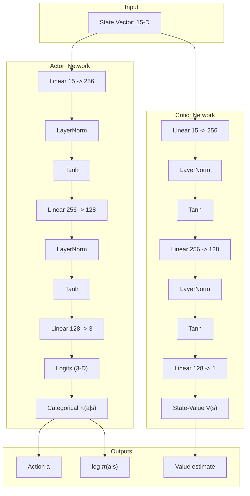

# Báo cáo Học thuật: Tối ưu hóa Mô hình Học tăng cường sâu Proximal Policy Optimization (PPO) với Generalized Advantage Estimation cho Chrome Dinosaur Agent

## Tóm tắt (Abstract)
Báo cáo này nghiên cứu phương pháp áp dụng thuật toán **Proximal Policy Optimization (PPO)** thuộc họ Policy Gradient On-policy để giải quyết bài toán điều khiển khủng long tự động trong môi trường Chrome Dinosaur. Khác với cách tiếp cận Q-learning (off-policy, value-based) trong báo cáo DQN, PPO trực tiếp tham số hoá chính sách hành động $\pi_\theta(a|s)$ thông qua kiến trúc Actor-Critic, sử dụng cơ chế *clipped surrogate objective* để giới hạn biên độ cập nhật chính sách, qua đó tránh hiện tượng sụp đổ chính sách (policy collapse) thường gặp trong các phương pháp gradient thô (vanilla policy gradient). Chúng tôi giữ nguyên thiết lập MDP đặc trưng 15-chiều ($15\text{-D}$ State Vector) và không gian hành động 3-chiều đã được kiểm chứng ở mô hình DQN, đồng thời tích hợp **Generalized Advantage Estimation (GAE)** với hệ số đánh đổi bias-variance $\lambda = 0.95$, *Orthogonal Initialization*, *Layer Normalization* và *Entropy Regularization* để đảm bảo tính ổn định trong huấn luyện. Mô hình tận dụng cùng môi trường `DinoEnv` và `AdaptiveSpawnPolicy` đã được sử dụng trong DQN, qua đó cho phép so sánh trực tiếp hai họ thuật toán trên cùng bộ tiêu chuẩn (benchmark).

---

## 1. Đặt vấn đề & Mô hình hóa MDP (Problem Formulation)

Môi trường game Chrome Dinosaur được mô hình hóa dưới dạng một **Quá trình Quyết định Markov** ký hiệu bởi bộ 5 thành phần:
$$\mathcal{M} = \langle S, A, P, R, \gamma \rangle$$

Trong đó:
*   $S$ là không gian trạng thái (State Space).
*   $A$ là không gian hành động rời rạc (Action Space).
*   $P(s' | s, a)$ là xác suất chuyển trạng thái từ $s$ sang $s'$ dưới hành động $a$. Do động lực học game là tất định (deterministic physics), $P(s' | s, a) = 1$ cho trạng thái vật lý kế tiếp.
*   $R(s, a)$ là hàm phần thưởng (Reward Function) phản hồi từ môi trường.
*   $\gamma \in [0, 1)$ là hệ số chiết khấu phần thưởng tương lai. Trong cấu hình này, $\gamma = 0.99$.

Mục tiêu tối ưu là cực đại hoá kỳ vọng tổng phần thưởng chiết khấu dưới chính sách $\pi_\theta$:
$$J(\theta) = \mathbb{E}_{\tau \sim \pi_\theta} \left[ \sum_{t=0}^{T} \gamma^t R(s_t, a_t) \right]$$

### 1.1. Không gian trạng thái $S$ (15-Dimensional State Vector)
Vector trạng thái 15-chiều $s_t \in \mathbb{R}^{15}$ được mã hoá và chuẩn hoá về $[0, 1]$ hoặc $[-1, 1]$, được chia thành 3 nhóm thông tin:

#### Nhóm 1: Đặc trưng 2 chướng ngại vật gần nhất ($i \in \{1, 2\}$, 5 đặc trưng mỗi vật cản)
1.  **Thời gian tới chướng ngại vật ($s_{5(i-1)}$)**:
    $$s_{5(i-1)} = \min\left(1.0, \frac{\text{dist\_px}_i / v_g}{60}\right)$$
2.  **Chiều cao chuẩn hoá ($s_{5(i-1)+1}$)**:
    $$s_{5(i-1)+1} = \min\left(1.0, \frac{\text{height}_i}{160}\right)$$
3.  **Chiều rộng chuẩn hoá ($s_{5(i-1)+2}$)**:
    $$s_{5(i-1)+2} = \min\left(1.0, \frac{\text{width}_i}{100}\right)$$
4.  **Chỉ báo loài bay - Pterodactyl ($s_{5(i-1)+3}$)**: $1.0$ cho chim, $0.0$ cho xương rồng.
5.  **Gợi ý hành động vật lý - Action Hint ($s_{5(i-1)+4}$)**:
    $$s_{5(i-1)+4} = \begin{cases} 0.0 & \text{nếu } d_{\text{ground}} < 40\text{ px} \text{ (NHẢY)} \\ 0.5 & \text{nếu } 40 \le d_{\text{ground}} < 80\text{ px} \text{ (CÚI)} \\ 1.0 & \text{nếu } d_{\text{ground}} \ge 80\text{ px} \text{ (CHẠY)} \end{cases}$$

#### Nhóm 2: Động học trò chơi
6.  **Tốc độ trò chơi chuẩn hoá ($s_{10}$)**: $s_{10} = v_g / v_{\max}$ với $v_{\max} = 20.0$.

#### Nhóm 3: Động học của Khủng long
7.  **Trạng thái đang nhảy ($s_{11}$)**: chỉ báo nhị phân.
8.  **Trạng thái đang cúi ($s_{12}$)**: chỉ báo nhị phân.
9.  **Thời gian còn lại trên không trung ước lượng ($s_{13}$)**: giải phương trình rơi tự do $y(t) = y_0 + v_y t + \frac{1}{2} g t^2$, chuẩn hoá qua $T_{\text{jump}} = 2 v_{\text{jump}} / g \approx 33.64$ frames.
10. **Vận tốc dọc chuẩn hoá ($s_{14}$)**: $s_{14} = v_y / v_{\text{jump}} \in [-1, 1]$.

### 1.2. Không gian hành động $A$
$$A = \{0: \text{DUCK}, 1: \text{JUMP}, 2: \text{RUN}\}$$

Trong PPO, agent không sử dụng chiến lược $\epsilon$-greedy như DQN, mà thay vào đó lấy mẫu hành động trực tiếp từ phân phối Categorical được tham số hoá bởi mạng Actor:
$$a_t \sim \text{Categorical}\left(\text{softmax}\left(\text{logits}_\theta(s_t)\right)\right)$$
Cơ chế lấy mẫu ngẫu nhiên này (stochastic policy) tự thân đã đảm bảo khả năng khám phá (exploration), được điều chỉnh ngầm thông qua hệ số *entropy bonus* trong hàm tổn thất (mục 2.6).

### 1.3. Mô hình hoá hàm phần thưởng $R(s, a)$
Hàm phần thưởng được kế thừa nguyên vẹn từ thiết kế đã chứng minh hiệu quả trong báo cáo DQN, đảm bảo cùng tiêu chuẩn so sánh:

$$R(s, a) = \begin{cases} -25.0 & \text{nếu va chạm (Game Over)} \\ R_{\text{survival}} + R_{\text{clear}} + R_{\text{penalty}} & \text{nếu sinh tồn} \end{cases}$$

*   $R_{\text{survival}} = +0.002$ mỗi frame.
*   $R_{\text{clear}}$: $+12.0$ cho vượt xương rồng, chim sát đất, chim tầm trung khi đang ở mặt đất; $+2.0$ nếu may mắn nhảy qua chim tầm trung; $-8.0$ khi nhảy va quẹt chim tầm cao.
*   $R_{\text{penalty}}$: $-0.5$ spam nhảy mặt đất, $-0.02$ spam nhảy trên không, $-0.15$ cúi vô cớ, $-0.06$ duy trì cúi vô hạn.

---

## 2. Kiến trúc thuật toán Proximal Policy Optimization

PPO thuộc họ **Policy Gradient** với kiến trúc Actor-Critic, được xây dựng trên 4 thành phần cốt lõi: *Surrogate Objective Clipping*, *Generalized Advantage Estimation*, *Value Function Loss*, và *Entropy Regularization*.



### 2.1. Định lý Gradient Chính sách (Policy Gradient Theorem)
Mục tiêu tối ưu của Policy Gradient là cực đại hoá kỳ vọng tổng phần thưởng chiết khấu. Định lý Gradient Chính sách (Sutton et al., 1999) phát biểu:
$$\nabla_\theta J(\theta) = \mathbb{E}_{\tau \sim \pi_\theta} \left[ \sum_{t=0}^{T} \nabla_\theta \log \pi_\theta(a_t | s_t) \cdot \Psi_t \right]$$
Trong đó $\Psi_t$ là một ước lượng "tín hiệu thưởng" (return signal). Các lựa chọn phổ biến gồm: return chiết khấu tổng cộng $G_t = \sum_{k=t}^{T} \gamma^{k-t} r_k$, sai số TD $\delta_t$, hoặc Advantage $A^\pi(s_t, a_t) = Q^\pi(s_t, a_t) - V^\pi(s_t)$. PPO sử dụng **Generalized Advantage Estimation (GAE)** trình bày ở mục 2.3, đóng vai trò là biến thể có phương sai thấp nhưng bias kiểm soát được của $A^\pi$.

### 2.2. Hàm mục tiêu Đại diện có Cắt (Clipped Surrogate Objective)
Vanilla Policy Gradient có nhược điểm cố hữu: khi tính gradient bằng các quỹ đạo lấy mẫu từ chính sách cũ $\pi_{\theta_{\text{old}}}$ và áp dụng để cập nhật cho chính sách mới $\pi_\theta$, nếu bước cập nhật quá lớn, chính sách mới có thể chệch quá xa khỏi vùng tin cậy (trust region), gây sụp đổ chính sách không thể phục hồi.

TRPO (Schulman et al., 2015) giải quyết bằng ràng buộc cứng KL-divergence, nhưng tốn kém về tính toán. PPO (Schulman et al., 2017) thay thế bằng cơ chế cắt tỉ số xác suất một cách *implicit*:

Định nghĩa tỉ số xác suất hành động giữa chính sách mới và cũ:
$$r_t(\theta) = \frac{\pi_\theta(a_t | s_t)}{\pi_{\theta_{\text{old}}}(a_t | s_t)}$$

Hàm tổn thất chính sách clipped của PPO:
$$L^{\text{CLIP}}(\theta) = \mathbb{E}_t \left[ \min\left( r_t(\theta) \hat{A}_t, \; \text{clip}(r_t(\theta), 1 - \epsilon, 1 + \epsilon) \hat{A}_t \right) \right]$$

Với $\epsilon = 0.2$ là biên độ tin cậy.

**Cơ chế hoạt động của clip**:
*   Nếu $\hat{A}_t > 0$ (hành động tốt): tăng $r_t$ làm tăng $L^{\text{CLIP}}$, nhưng giới hạn ở $1 + \epsilon$ → ngăn gia tăng xác suất quá mức.
*   Nếu $\hat{A}_t < 0$ (hành động xấu): giảm $r_t$ làm giảm $|L^{\text{CLIP}}|$, nhưng giới hạn ở $1 - \epsilon$ → ngăn triệt tiêu xác suất quá mức.

Trong code, để dùng dạng hàm tổn thất (loss = âm của objective):
```
pg_loss1 = -A * r
pg_loss2 = -A * clip(r, 1 - ε, 1 + ε)
pg_loss  = max(pg_loss1, pg_loss2).mean()
```

### 2.3. Generalized Advantage Estimation (GAE)
Ước lượng Advantage $\hat{A}_t$ trực tiếp bằng Monte Carlo (return - value) có variance cao, trong khi dùng TD($0$) có bias cao. GAE (Schulman et al., 2016) cân bằng hai cực này bằng tổ hợp tuyến tính có trọng số mũ:
$$\hat{A}_t^{\text{GAE}(\gamma, \lambda)} = \sum_{l=0}^{\infty} (\gamma \lambda)^l \delta_{t+l}$$
Với sai số TD một bước:
$$\delta_t = r_t + \gamma V(s_{t+1}) - V(s_t)$$

Trường hợp đặc biệt:
*   $\lambda = 0$: $\hat{A}_t = \delta_t$ → ước lượng TD($0$), bias cao, variance thấp.
*   $\lambda = 1$: $\hat{A}_t = \sum_{l=0}^{\infty} \gamma^l \delta_{t+l} = G_t - V(s_t)$ → ước lượng Monte Carlo, bias thấp, variance cao.

Cấu hình $\lambda = 0.95$ được lựa chọn để duy trì variance ở mức thấp đến trung bình mà vẫn giảm thiểu bias.

**Triển khai đệ quy ngược thời gian** (reverse-time recursion):
$$\hat{A}_t = \delta_t + \gamma \lambda \cdot (1 - d_{t+1}) \cdot \hat{A}_{t+1}$$
Trong đó $d_t \in \{0, 1\}$ là cờ kết thúc episode (terminal mask) — đảm bảo Advantage không lan ngược qua ranh giới giữa các episode.

Return mục tiêu cho mạng Critic:
$$V_t^{\text{target}} = \hat{A}_t + V(s_t)$$

### 2.4. Hàm tổn thất Value Function
Mạng Critic được huấn luyện theo Mean Squared Error giữa giá trị dự đoán và return mục tiêu (GAE-based):
$$L^{\text{VF}}(\theta) = \frac{1}{2} \mathbb{E}_t \left[ \left( V_\theta(s_t) - V_t^{\text{target}} \right)^2 \right]$$

Hệ số $\frac{1}{2}$ giúp cân bằng độ lớn so với Policy Loss và đơn giản hoá đạo hàm.

### 2.5. Chuẩn hoá Advantage trên Mini-batch
Để ổn định gradient và làm cho thuật toán bất biến với scale phần thưởng (reward scale invariance), Advantage được chuẩn hoá z-score trong mỗi mini-batch trước khi đưa vào $L^{\text{CLIP}}$:
$$\hat{A}_t \leftarrow \frac{\hat{A}_t - \mu_{\hat{A}}}{\sigma_{\hat{A}} + 10^{-8}}$$

Lưu ý: chuẩn hoá này được thực hiện *sau* khi GAE đã tính xong cho toàn bộ rollout — không phá huỷ tín hiệu thời gian, chỉ điều chỉnh độ lớn.

### 2.6. Phần thưởng Entropy (Entropy Regularization)
Để khuyến khích chính sách duy trì độ ngẫu nhiên (exploration) tránh hội tụ sớm vào các chính sách tất định cực trị cục bộ, một hệ số thưởng entropy được thêm vào hàm tổn thất tổng:
$$L^{S}(\theta) = \mathbb{E}_t \left[ H\left( \pi_\theta(\cdot | s_t) \right) \right] = - \mathbb{E}_t \left[ \sum_a \pi_\theta(a | s_t) \log \pi_\theta(a | s_t) \right]$$

Hệ số $c_2 = 0.01$ (entropy coefficient) đảm bảo entropy bonus có ảnh hưởng vừa phải, không lấn át tín hiệu policy gradient chính.

### 2.7. Hàm tổn thất tổng (Total Loss)
Kết hợp ba thành phần trên thành hàm tổn thất duy nhất để tối ưu đồng thời Actor và Critic:
$$L(\theta) = - L^{\text{CLIP}}(\theta) + c_1 L^{\text{VF}}(\theta) - c_2 L^{S}(\theta)$$

Với hệ số trọng số: $c_1 = 0.5$ (`value_coef`), $c_2 = 0.01$ (`entropy_coef`). Dấu âm trước $L^{\text{CLIP}}$ và $L^{S}$ chuyển từ *objective cực đại* sang *loss cực tiểu* phù hợp với toán tử `backward()` chuẩn trong PyTorch.

### 2.8. Vòng tối ưu hoá nhiều epoch trên cùng rollout
Một điểm đặc thù của PPO cho phép tái sử dụng dữ liệu là cơ chế *importance sampling* nội tại trong $r_t(\theta)$. Mỗi rollout gồm $N_{\text{rollout}} = 4{,}096$ steps được lặp đi lặp lại $K = 10$ epoch, mỗi epoch chia thành nhiều mini-batch kích thước $B = 256$:
$$\text{Tổng số gradient steps mỗi rollout} = \frac{N_{\text{rollout}}}{B} \times K = 16 \times 10 = 160$$

Việc shuffle chỉ số (`np.random.shuffle(b_inds)`) trước mỗi epoch giúp phá vỡ tương quan thời gian giữa các sample liên tiếp.

### 2.9. Cắt chuẩn Gradient (Gradient Clipping)
Trước khi áp dụng `optimizer.step()`, chuẩn L2 toàn cục của gradient được cắt:
$$\|\nabla_\theta L\| \leftarrow \min\left( \|\nabla_\theta L\|, \; \text{max\_grad\_norm} \right)$$
Với `max_grad_norm` $= 0.5$, ngưỡng thấp hơn DQN ($5.0$) do PPO sử dụng `Tanh` (gradient bounded) thay vì `ReLU` (gradient có thể bùng nổ).

---

## 3. Cấu trúc mạng thần kinh Actor-Critic

### 3.1. Tham số kiến trúc lớp
Khác với DQN sử dụng một mạng chung với hai nhánh đầu ra (Dueling Heads), PPO triển khai **hai mạng độc lập** cho Actor và Critic. Cách tách rời này tránh hiện tượng gradient của Critic (thường có độ lớn lớn hơn) lấn át gradient của Actor:

**Actor Network** ($\pi_\theta(a | s)$):
*   `Linear(15, 256)` $\rightarrow$ `LayerNorm(256)` $\rightarrow$ `Tanh`
*   `Linear(256, 128)` $\rightarrow$ `LayerNorm(128)` $\rightarrow$ `Tanh`
*   `Linear(128, 3)` $\rightarrow$ logits $\rightarrow$ Categorical($\pi_\theta$)

**Critic Network** ($V_\phi(s)$):
*   `Linear(15, 256)` $\rightarrow$ `LayerNorm(256)` $\rightarrow$ `Tanh`
*   `Linear(256, 128)` $\rightarrow$ `LayerNorm(128)` $\rightarrow$ `Tanh`
*   `Linear(128, 1)` $\rightarrow$ $V(s)$

### 3.2. Lựa chọn hàm kích hoạt Tanh thay cho ReLU
Trong khi DQN sử dụng ReLU phù hợp với hàm giá trị $Q$ không bị chặn, PPO áp dụng **Tanh** xuyên suốt các lớp ẩn do các lý do sau:
*   **Đầu ra bounded $[-1, 1]$**: ngăn ngừa activation bùng nổ, đặc biệt quan trọng khi tỉ số $r_t(\theta) = \pi_\theta / \pi_{\theta_{\text{old}}}$ chứa hàm $\exp(\cdot)$ — rất nhạy với độ lớn logits.
*   **Đạo hàm trơn liên tục**: không có điểm gãy như ReLU, hỗ trợ tối ưu trust-region của PPO.
*   **Truyền thống thực nghiệm**: nghiên cứu của Andrychowicz et al. (2021) trong *"What Matters in On-Policy Reinforcement Learning?"* xác nhận Tanh ổn định hơn ReLU cho PPO trên dải benchmark MuJoCo và Atari.

### 3.3. Khởi tạo Orthogonal Initialization
PPO áp dụng phương pháp **khởi tạo trực giao (Orthogonal Initialization)** với độ lệch chuẩn được điều chỉnh theo vai trò của lớp:
$$W \sim \text{Orthogonal}\left( \text{gain} = \text{std} \right), \quad b = 0$$

Cấu hình lựa chọn theo công thức Saxe et al. (2014):
*   Các lớp ẩn: $\text{std} = \sqrt{2}$ (đẳng cấu với khởi tạo Kaiming cho ReLU/Tanh).
*   Lớp đầu ra **Actor** (logits): $\text{std} = 0.01$ — *cố ý nhỏ* để khởi đầu chính sách gần đồng đều (uniform policy), tăng khám phá ban đầu.
*   Lớp đầu ra **Critic** (V-value): $\text{std} = 1.0$ — giữ scale tự nhiên cho giá trị trạng thái.

Khởi tạo trực giao đảm bảo các vector hàng của ma trận trọng số trực giao đôi một, giúp tránh hiện tượng tương quan kích hoạt giữa các neuron, hỗ trợ độ ổn định gradient ở các tầng sâu.

### 3.4. Vai trò của Layer Normalization
Tương tự DQN, PPO áp dụng Layer Normalization sau mỗi lớp Linear ẩn:
$$\hat{x}_{ij} = \frac{x_{ij} - \mu_i}{\sqrt{\sigma_i^2 + \epsilon_0}}$$
Lợi ích trong ngữ cảnh PPO:
*   Ổn định hoá phân phối kích hoạt qua các epoch tối ưu nội tại (mục 2.8), khi cùng một batch dữ liệu được duyệt nhiều lần với $\theta$ thay đổi.
*   Cho phép sử dụng learning rate cao hơn mà không lo gradient bùng nổ.
*   Phù hợp với batch size lớn ($B = 256$) trong huấn luyện PPO.

---

## 4. Chiến lược huấn luyện On-policy (On-Policy Training Strategies)

### 4.1. Cơ chế Rollout Buffer (Buffer trên-chính-sách)
Khác với DQN sử dụng *Off-policy Replay Buffer* lưu trữ hàng trăm nghìn transition cũ kế thừa từ nhiều chính sách trong quá khứ, PPO triển khai **Rollout Buffer trên-chính-sách** có dung lượng cố định bằng $N_{\text{rollout}} = 4{,}096$ steps. Mỗi chu kỳ:
1.  Agent thực thi $N_{\text{rollout}}$ bước môi trường, lấy hành động từ chính sách hiện tại $\pi_{\theta_{\text{old}}}$.
2.  Lưu lại: $(s_t, a_t, \log \pi_{\theta_{\text{old}}}(a_t|s_t), r_t, V_{\theta_{\text{old}}}(s_t), d_t)$.
3.  Tính GAE-Advantage $\hat{A}_t$ và Return mục tiêu $V_t^{\text{target}}$ theo công thức đệ quy mục 2.3.
4.  Lặp $K = 10$ epoch x $\frac{N_{\text{rollout}}}{B} = 16$ mini-batch để cập nhật $\theta$.
5.  Xoá toàn bộ buffer (`buffer.clear()`).

Quan trọng: dữ liệu cũ *không được tái sử dụng* sau khi $\theta$ đã thay đổi, vì giả thiết on-policy của Policy Gradient yêu cầu chính sách thu thập và chính sách cập nhật trùng nhau hoặc đủ gần.

### 4.2. Ngẫu nhiên hoá tốc độ khởi tạo (Speed Randomization)
Để đối phó với hiện tượng phân phối tốc độ lệch ($v_g$ thấp trong giai đoạn đầu episode, hiếm khi đạt $v_{\max}$ ngay lập tức), PPO áp dụng kỹ thuật ngẫu nhiên hoá tốc độ ở mỗi lần reset:
$$v_{g}(0) \sim \text{Uniform}(v_{\text{init}}, \min(v_{\text{init}} + 4.0, v_{\max}))$$
Cách tiếp cận này khiêm tốn hơn so với chiến lược *Speed-Range Coverage* của DQN (vốn phủ toàn bộ dải $[v_{\text{init}}, v_{\max}]$ ở 50% episode), do PPO tự nhiên thu thập rollout dài ($N_{\text{rollout}} = 4096$ frames $\approx$ ~70 giây gameplay) trong đó tốc độ đã tự tăng lên đáng kể theo cơ chế gia tốc nội tại.

### 4.3. Chính sách sinh vật cản thích ứng (Adaptive Spawn Policy)
PPO sử dụng chung lớp `AdaptiveSpawnPolicy` với DQN — đảm bảo môi trường đánh giá đồng nhất giữa hai thuật toán:
*   **Giai đoạn đầu ($E < 10\%$)**: tỉ lệ chim, cụm xương rồng phức tạp thấp.
*   **Giai đoạn giữa ($10\% \le E < 60\%$)**: tăng dần tần suất chim Pterodactyl, gap thu hẹp.
*   **Giai đoạn cuối ($E \ge 60\%$)**: độ khó tối đa, tổ hợp combo wall/chain/sandwich.

### 4.4. Lưu mô hình tốt nhất (Best-Model Checkpointing)
Mỗi khi điểm số một episode vượt qua kỷ lục hiện tại, trọng số mạng được lưu ngay lập tức:
```
if dino.score > self.best_score:
    self.best_score = dino.score
    self.save_model(save_path.replace('.pkl', '_best.pkl'))
```
Cơ chế này bảo vệ mô hình khỏi hiện tượng *catastrophic forgetting* — tình huống phổ biến trong PPO khi chính sách hội tụ tốt rồi đột ngột thoái hoá do bước cập nhật xấu xảy ra ở giai đoạn sau.

---

## 5. Siêu tham số cấu hình hệ thống (Hyperparameters)

Bảng thống kê toàn bộ siêu tham số được cấu hình trong `PPO_CONFIG`:

| Nhóm tham số | Siêu tham số | Giá trị | Ý nghĩa vật lý / Vai trò thuật toán |
|---|---|---|---|
| **Kiến trúc mạng** | `state_size` | 15 | Kích thước vector trạng thái đầu vào |
| | `action_size` | 3 | Số hành động rời rạc (DUCK, JUMP, RUN) |
| | `hidden_sizes` | `[256, 128]` | Số neuron các tầng ẩn của Actor và Critic |
| | Activation | `Tanh` | Hàm kích hoạt bounded $[-1, 1]$, ổn định cho PPO |
| | Init Actor logits | `std=0.01` | Khởi tạo chính sách gần uniform → tăng exploration ban đầu |
| | Init Critic head | `std=1.0` | Giữ scale tự nhiên cho giá trị trạng thái |
| | Init hidden | `std=√2` | Orthogonal Initialization chuẩn cho lớp ẩn |
| **Vòng Rollout**  | `n_rollout_steps` | 4,096 | Số bước môi trường thu thập trước mỗi lần cập nhật |
| | `batch_size` | 256 | Kích thước mini-batch trong vòng tối ưu hoá nội tại |
| | `n_epochs` | 10 | Số lần duyệt lại cùng rollout trong tối ưu hoá |
| | Số mini-batches/rollout | 16 | $N_{\text{rollout}} / B$ |
| | Tổng gradient steps/rollout | 160 | $K \times N_{\text{rollout}} / B$ |
| **Tối ưu hoá (Optim)** | `learning_rate` | $3 \times 10^{-4}$ | Tốc độ học Adam, mặc định khuyến cáo của PPO |
| | Adam `eps` | $10^{-5}$ | Hằng số ổn định mẫu Adam |
| | `gamma` ($\gamma$) | 0.99 | Hệ số chiết khấu phần thưởng tương lai |
| | `gae_lambda` ($\lambda$) | 0.95 | Hệ số đánh đổi bias-variance trong GAE |
| | `clip_epsilon` ($\epsilon$) | 0.2 | Biên độ trust region của tỉ số $r_t(\theta)$ |
| | `value_coef` ($c_1$) | 0.5 | Trọng số $L^{\text{VF}}$ trong hàm tổn thất tổng |
| | `entropy_coef` ($c_2$) | 0.01 | Trọng số entropy bonus, kiểm soát exploration |
| | `max_grad_norm` | 0.5 | Ngưỡng cắt chuẩn L2 gradient toàn cục |
| **Huấn luyện** | Episodes | 2,000 (default) | Số episode mặc định cho `train_from_scratch` |
| | Resume episodes | 1,000 | Số episode tiếp tục khi `--resume` |
| | Speed reset range | $[v_{\text{init}}, v_{\text{init}}+4]$ | Khoảng tốc độ random hoá ở mỗi lần reset |

---

## 6. So sánh PPO và DQN trên Chrome Dino

| Khía cạnh | DQN (Dueling DDQN + PER) | PPO (Actor-Critic Clipped) |
|---|---|---|
| Họ thuật toán | Value-based, Off-policy | Policy-based, On-policy |
| Mục tiêu tối ưu | $\min_\theta L^{\text{TD}}(\theta)$ | $\max_\theta L^{\text{CLIP}}(\theta)$ |
| Bộ nhớ kinh nghiệm | Prioritized Replay Buffer ($2 \times 10^5$) | Rollout Buffer ($4{,}096$, xoá sau mỗi update) |
| Khám phá (Exploration) | $\epsilon$-greedy (decay $1.0 \rightarrow 0.01$) | Stochastic policy + entropy bonus |
| Hàm kích hoạt | ReLU | Tanh |
| Khởi tạo | Kaiming Normal | Orthogonal (std tùy lớp) |
| Hàm tổn thất | Smooth L1 (Huber) + IS weights | Clipped Surrogate + MSE + Entropy |
| Target stability | Target Network + Polyak (τ=0.003) | Không cần — Old policy stored trong $\log\pi_{\theta_{\text{old}}}$ |
| Số sample/update | 512 mỗi step (re-sample PER) | 256 × 10 epochs trên rollout cố định |
| Gradient clip | 5.0 | 0.5 |
| Speed coverage | 50% episode random toàn dải | Random tại reset, khoảng hẹp |
| Sample efficiency | Cao (tái sử dụng) | Thấp hơn (vứt rollout cũ) |
| Ổn định huấn luyện | Phụ thuộc PER + tau | Cao nhờ clip + KL implicit |

Lý thuyết: DQN nhỉnh hơn về **sample efficiency** trên môi trường tất định nhờ tái sử dụng kinh nghiệm, trong khi PPO ổn định hơn ở **policy convergence** nhờ ràng buộc trust-region. Trên Chrome Dino, cả hai đều khai thác được không gian trạng thái 15D mà không cần học vision-based encoder.

---

## 7. Kết luận & Định hướng phát triển

### 7.1. Kết luận
Báo cáo đã trình bày chi tiết cấu trúc toán học và kỹ thuật triển khai mô hình PPO áp dụng cho Dino Agent. Bằng việc tách rời kiến trúc Actor-Critic với *Layer Normalization*, *Orthogonal Initialization*, *Tanh* và áp dụng cơ chế *clipped surrogate objective* kết hợp *GAE*, mô hình tránh được hiện tượng sụp đổ chính sách thường gặp ở các thuật toán policy gradient cổ điển. Sự đồng nhất trong thiết kế MDP (15-D State Vector, hàm reward) và chính sách sinh môi trường (`AdaptiveSpawnPolicy`) với mô hình DQN cho phép so sánh trực tiếp hai họ thuật toán DRL trên cùng một bộ benchmark, mở ra hướng phân tích đặc tính sample efficiency và policy stability một cách định lượng.

### 7.2. Định hướng phát triển
1.  **PPO với hành động liên tục (Continuous Action PPO)**: Mở rộng không gian hành động sang $A \in \mathbb{R}^k$, cho phép agent điều khiển lực nhảy (jump impulse) và thời gian cúi (duck duration) như biến liên tục. Phù hợp với cấu trúc Gaussian Policy có $\mu, \sigma$ phụ thuộc trạng thái.
2.  **Recurrent PPO (LSTM/GRU)**: Tích hợp tầng hồi quy giữa Feature Extractor và đầu ra, cho phép Agent suy luận từ chuỗi quan sát thời gian thay vì chỉ một frame hiện tại. Đặc biệt hữu ích khi obstacles bị che lấp ngắn hạn (partial observability).
3.  **Multi-Step Return Bootstrapping (PPO + V-trace)**: Áp dụng kỹ thuật V-trace của IMPALA (Espeholt et al., 2018) để cho phép off-policy correction nhỏ, hỗ trợ huấn luyện phân tán nhiều worker đồng thời.
4.  **So sánh thực nghiệm DQN vs PPO**: Đo lường định lượng (a) sample efficiency, (b) wall-clock time tới ngưỡng điểm mục tiêu, (c) variance giữa các seed, (d) generalization ở các cấu hình spawn chưa thấy trong huấn luyện.
5.  **PPO + Curiosity-Driven Exploration (ICM/RND)**: Bổ sung phần thưởng nội sinh dựa trên độ mới (novelty) của trạng thái, giúp agent khám phá các vùng trạng thái có spawn pattern hiếm gặp trong giai đoạn cuối curriculum.
